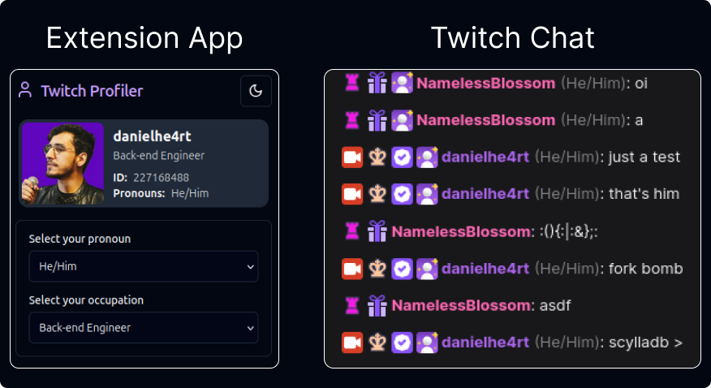
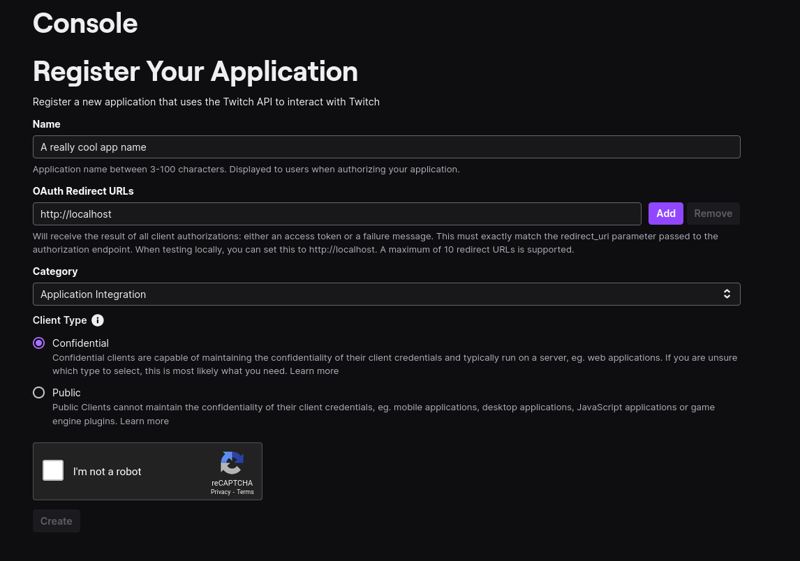
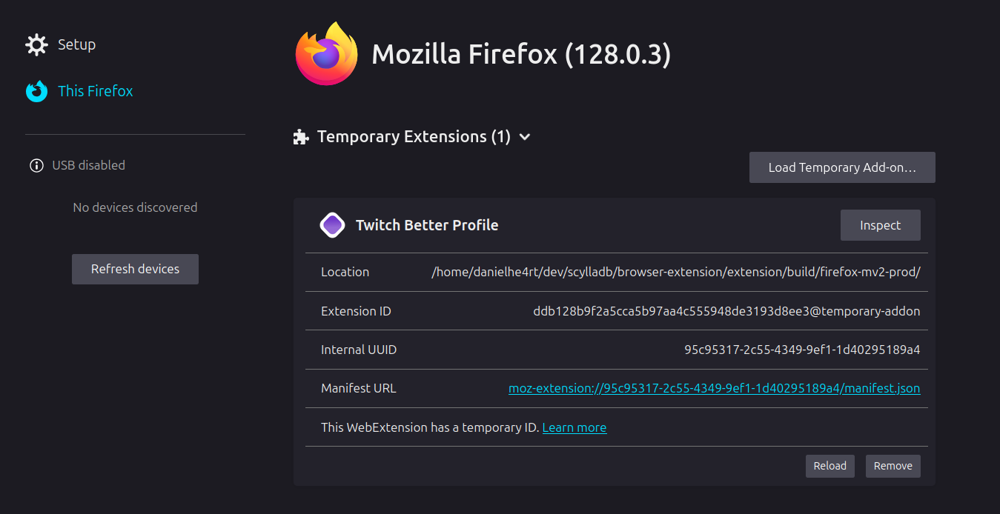
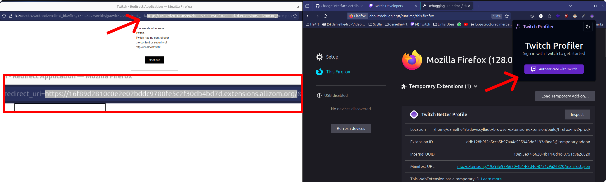
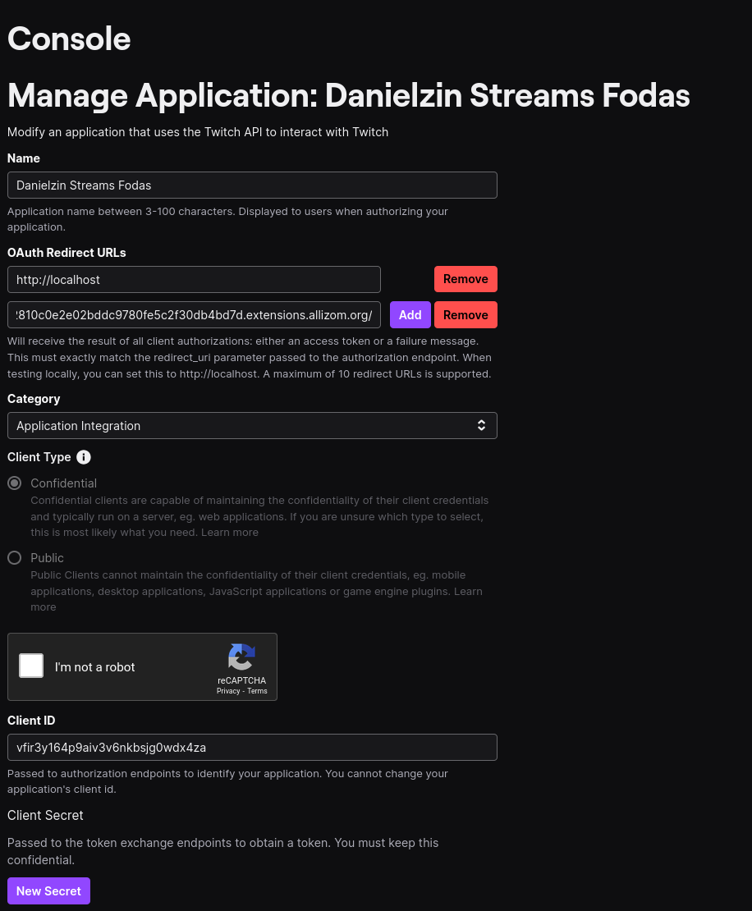
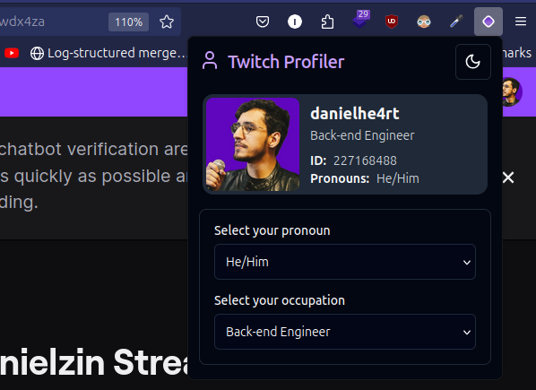

# Twitch Better Profile



## Table of Contents
- [Introduction](#introduction)
- [Prerequisites](#prerequisites)
- [Installation](#installation)
  - [Backend Installation](#backend-installation)
  - [Frontend Installation](#frontend-installation)
- [Usage](#usage)
- [Contributing](#contributing)
- [License](#license)

## Introduction
This project uses Rust with Actix and ScyllaDB (using the Charybdis driver) for the backend, and React with Plasmo for the frontend. The project is organized into two main folders: `extension` for the frontend and `api` for the backend.


## Prerequisites
Make sure you have the following tools installed on your machine:
- Back-end/API: 
  - Rust and Cargo: [Install Rust](https://www.rust-lang.org/tools/
  - ScyllaDB: [Run ScyllaDB with Docker](https://github.com/gvieira18/ws-scylla/)
install)
- Front-end/Extension:
  - pnpm: [Install pnpm](https://pnpm.io/installation)

Also you gonna need a [Twitch Developer](https://dev.twitch.tv/) account and an [Twitch Application](https://dev.twitch.tv/console/apps/create):



> [!INFO]
> You will set a default OAuth Callback URL to create your extension in this first moment.


## Running the Extension


1. Navigate to the extension directory:

```sh
cd extension
```

2. Install the Node.js dependencies using pnpm:

```
pnpm install
```

3. Run the plasmo dev mode with Firefox as our target: 

```
pnpm dev:firefox
```

This will create a server for hot-reload together with a dev extension that you can find at `./extension/build/firefox-mv2-dev`

4. Access the [about:debugging](about:debugging) tab (firefox only) and load your extension by selecting the `manifest.json` file:




5. Run the Authentication for the first time and retrieve the `redirect_url` and add it to Twitch App.





6. Close the Redirect Tab and try to authenticate again:



## Contributing 

We welcome contributions to improve this project! To contribute, please follow these steps:

1. Fork the repository and clone it to your local machine.
2. Create a new branch for your changes: 
  ```sh
  git checkout -b feature/your-feature-name
  ```
3. Make your desired changes to the codebase.
4. Test your changes to ensure they work as expected.
5. Commit your changes with a descriptive commit message:
  ```sh
  git commit -m "Add feature/fix: description of your changes"
  ```
6. Push your changes to your forked repository:
  ```sh
  git push origin feature/your-feature-name
  ```
7. Open a pull request in the original repository and provide a clear description of your changes.
8. Wait for the project maintainers to review and merge your pull request.

Thank you for contributing to this project! Your help is greatly appreciated.


## License

This project is licensed under the MIT License - see the [LICENSE](LICENSE) file for details.

